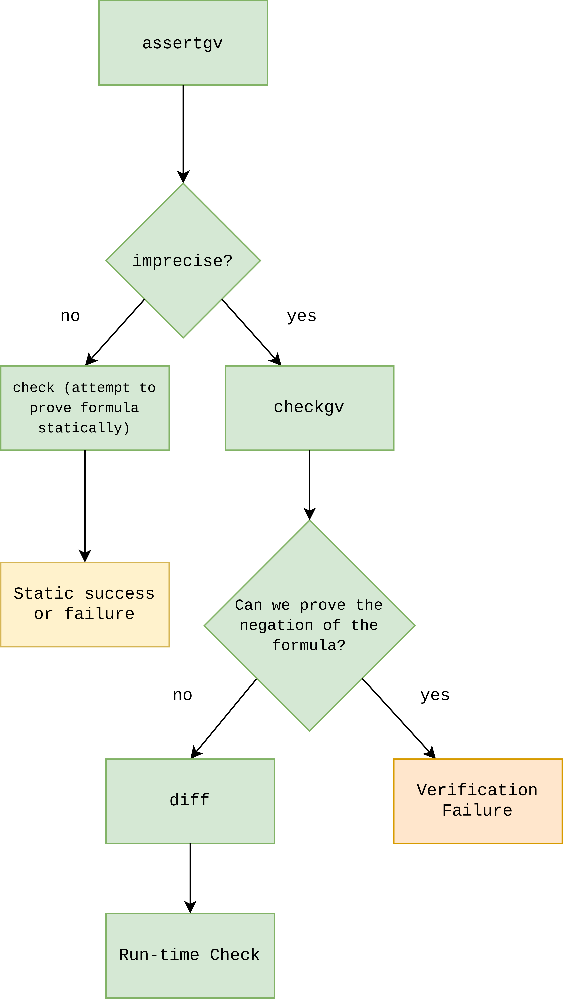

# Gradual Verifier Backend Architecture

## General Definitions

### Symbolic Store

Contains mappings from concrete variables to symbolic variables. A symbolic
variable may have more than one concrete variable mapped to it, so it's not
necessarily true that performing a reverse lookup on the symbolic store returns
only one result.

### Symbolic Evaluation Rules

You can refer to the symexec document in the recursive predicates repository
for detailed descriptions of all the symbolic evaluation rules. Here I've
listed (very) short summaries of all of the four types of rules that should be
sufficient for understanding the rest of this document.

* __Exec__

Used for symbolically running Viper terms which have side effects, such as
method calls or loops.

* __Eval__

Used for evaluating Viper expressions.

* __Consume__

You can think of this as a way to remove permissions, generally speaking, or
test if we have some permissions by attempting to remove them. This is where
most of the interesting run-time checking functionality is.

* __Produce__

This is the opposite of consume. It creates permissions and adds them to the
symbolic state.

### Check

`check` takes a term as an argument. Check returns true if the verifier can
prove it using the verification info (namely the path condition), or false
otherwise.

### Self Framing

In a fully static setting, when a formula is self framed, it means that all
the permissions (like field accesses) used by the formula correspond to
permissions also contained by the formula.

Another way of saying this is that the formula should contain all the
permissions it uses.

In a gradual setting, the presence of `?`, or imprecision, can account for
missing framing permissions.

### Assertgv

The function for gradual assertions.

__If the state is precise__, it should be equivalent to assert.

__If the state is imprecise__, then it checks if we can prove the negation of
the asserted formula. If we can't, it returns true, along with the residual
portion of the formula that was optimistically assumed. Otherwise, it returns
false.

## Runtime Checking

### Table of Contents

1. [Summary](#summary)
2. [Overview](#overview)
3. [Translate](#translator)
4. [Diff](#diff)
5. [Position Tracking](#position-tracking)

### Summary

<b>
TL;DR:

Run-time checking happens roughly whenever optimistic assumption happens,
in order to ensure soundness. To figure out where and why run-time checks
are happening, look for situations where the state has become imprecise
(so we're allowed to do optimistic assumption) and where we reach a case
where we have to rely on run-time information to verify specifications
(an optimistic assumption has happened).
</b>

### Overview

There are three primary parts of the runtime checking infrastructure to take
note of. The first is the translator, which is likely the most complicated and
error-prone of the three subsystems. The second is a transformation to
conjunctive normal form (CNF) done on formulas given to [assertgv](#assertgv)
when the state is imprecise, to allow for finding minimal run-time checks. The
last, which tracks positional information during verification, isn't a
well-contained system like the previous two, but comprises a sizable portion of
the changes made to the symbolic evaluation rules to support run-time checks
(highlighted in blue in the symexec document).

Finally, the verifier has been instrumented with profiling tooling. Any lines
starting with `profilingInfo`, or branches containing only `profilingInfo`, are
for this purpose, and you can usually pretend like they're not there unless you
need the information provided by it (which is counting eliminated and total
conjuncts on a per formula basis).

To get started with understanding the run-time checking implementation, looking
at the case for `ast.FieldAccessPredicate` in the method `consumeTlc` inside
`Consumer.scala` should provide a simple case of run-time check generation for
when there's insufficient information to statically prove that a field can be
accessed.

```scala
if (s4.isImprecise) {
```

Entering this branch means we're in an imprecise state. Optimistic assumptions
are allowed, and run-time checks are, too!

```scala
val runtimeCheckAstNode: CheckPosition =
  (s5.methodCallAstNode, s5.foldOrUnfoldAstNode, s5.loopPosition) match {
    case (None, None, None) => CheckPosition.GenericNode(locacc)
        case (Some(methodCallAstNode), None, None) =>
        CheckPosition.GenericNode(methodCallAstNode)
        case (None, Some(foldOrUnfoldAstNode), None) =>
        CheckPosition.GenericNode(foldOrUnfoldAstNode)
        case (None, None, Some(loopPosition)) => loopPosition
    case _ => sys.error("Conflicting positions!")
}
```

This resolves [positional information](#position-tracking) for the run-time
check, and saves it to a variable to later be attached to the run-time check.
It looks complicated, but it's just enumerating all the possible sources and
cases that could be involved in determining the right position for the check.

```scala
runtimeChecks.addChecks(runtimeCheckAstNode,
        ast.FieldAccessPredicate(ast.FieldAccess(translatedArgs.head,
            resource.asInstanceOf[ast.Field])(), perm)(),
        viper.silicon.utils.zip3(v4.decider.pcs.branchConditionsSemanticAstNodes,
            v4.decider.pcs.branchConditionsAstNodes,
            v.decider.pcs.branchConditionsOrigins).map(bc => BranchCond(bc._1, bc._2, bc._3)),
        a,
        s5.forFraming)
```

This actually generates the check. The first argument is the position we
found, the second is the run-time check we need at that program point. The
third is branching information needed by the frontend to correctly determine,
at run-time, when the check should be done (it should only be done down the
specific branch on which it was generated). The fourth argument provides
additional positioning information to the frontend, and the last argument
provides information to the frontend on whether this check was a
[framing](#self-framing) check: this allows for more efficient run-time checks
to be inserted into the generated C0 program by the frontend.

### Translator

The translator lifts Gradual Viper terms (the representation of a program
inside the verifier) into Silicon AST nodes. This is mostly done using a simple
recursive interpreter defined by pattern matching terms into their AST node
representations. Most of the complexity is in the variable resolver, which,
given a term that could represent a variable or a field, returns the variable
or field it could represent in the original program.

#### Variable Resolution Strategy

We first retrieve all __aliases of the variable to translate__ from the path
condition. We need to do this because the path condition (which contains all
the logical expressions the verifier knows to be true about the program).
Specifically, because Silicon does symbolic execution, it might figure out that
two variables alias, and instead of storing information the variable resolver
needs in terms of the variable to translate, it (might) store information in
terms of the aliased variable. The good news, is that when this happens, we can
emit Silver AST nodes in terms of the variable Silicon knows is aliased, too.
If Silicon is sound (and it should be!), this should not cause any problems,
because those same variables should be aliased at runtime. We then attempt two
strategies for resolving variables on all known aliases.

##### Regular Variable Resolver

The regular variable resolver is the first one we try. Here, we first search
the symbolic store for a symbolic variable matching the term we're attempting
to translate. If no such entry exists, we look for a heap entry that contains
such a term. If, again, we can't find something in the heap, the optimistic
heap is finally searched. If this fails, variable resolution returns
unsuccessfully. We'll describe each of these two cases here.

1. __Store search succeeds__

The variable resolver returns the concrete variable that was found in the
store.

2. __Store search fails, heap or optimistic heap search succeeds__

We call the variable resolver again on the returned heap entry. In the
simple case, this causes the store to be searched with the heap entry that
was returned. You might think of a simple translation scenario involving
heap lookups like this:

```
Heap(term) -> Store(heapValue) -> Concrete Variable (Silver AST node)
```

Of course, keep in mind that since the variable resolver is being called
again here, there might be more than one heap lookup involved before we
get to something in the store!

##### Regex Variable Resolver

If regular variable resolution fails for some reason (Silicon might not be
keeping around certain heap entries that we need), we attempt to resolve
variables by parsing the variable out of the string directly. This is
usually needed when we have nested fields to translate within a variable.

The regex variable resolver first extracts the receiver from the variable to be
translated. For a field access `e.f.g`, this would be `e.f`. The receiver is
resolved (mostly) as normal through a store lookup (mostly, because the store
needs to be looked up such that it compares terms structurally, since we
manually extracted the receiver from the variable given to us, instead of
finding it through the heap).

If the store lookup fails, we call the variable resolver on the receiver,
beginning the variable resolution process again for the term representing the
receiver.

#### Bug Finding Note

If you've run into a weird bug and you're not sure where to start looking,
unless you have reason to think otherwise, the translator is a good starting
point. The problem it addresses is quite complicated and the translator has
been the source of errors in the past.

### Diff

When a formula is gradually asserted through [assertgv](#assertgv), and we
have that both the state is imprecise and we can't prove the negation of
the asserted formula, we need to create a run-time check. Ideally, we should
only check the parts of the asserted formula we cannot prove. Diff is
responsible for optimizing the run-time checks produced this way by finding
a minimal formula from the one given to [assertgv](#assertgv).

It does this by first transforming the asserted formula to conjunctive normal
form, or CNF, and then calling [check](#check) on each conjunct. If `check`
returns true, we remove the conjunct from the formula.

<p align="center">

</p>

### Position Tracking

You might notice that, throughout the verifier, there's machinery to add
positional information to runtime checks and to branching information (and
possibly more). The class that describes how the positioning information is
structured is in `src/main/scala/state/CheckPosition.scala`. There are two
main kinds of positioning information, generic nodes and loops:

```scala
object CheckPosition {
  case class GenericNode(node: ast.Node) extends CheckPosition
  case class Loop(invariants: Seq[ast.Exp], position: LoopPosition) extends CheckPosition
}
```

`GenericNode` is used to indicate positional information that can be fully
described by an AST node from the input Silver program. `Loop` is used
specifically when verifying a loop, and may take any of four forms:

```scala
object LoopPosition {
  case object Before extends LoopPosition
  case object After extends LoopPosition
  case object Beginning extends LoopPosition
  case object End extends LoopPosition
}
```

#### Outside the loop body

* `Before` is used when we [consume](#consume) the loop invariant before
  actually entering the loop.

* `After` is used when we [produce](#produce) the loop invariant after
  verifying the loop body (so still outside the loop).

#### Inside the loop body

* `End` is used when we [consume](#consume) the loop invariant at the end of
  the body (which proves that it's maintained).

* `Beginning` is used when we [produce](#produce) the loop invariant at the
  beginning of the body (because the rest of the body needs it).

Additionally, the Silver expressions representing the invariant (the
`Seq[ast.Exp]` should be thought of as a conjunction of a bunch of formula
terms) are included in the positional information, to uniquely identify the
loop in the program.
